# Indroduction to Atmospheric Entry

*This handout was created exclusively for the course "Hypersonic Aerodynamics and Atmospheric Entry" at FH Aachen University of Applied Sciences by Prof. Dr. Bernd Dachwald*

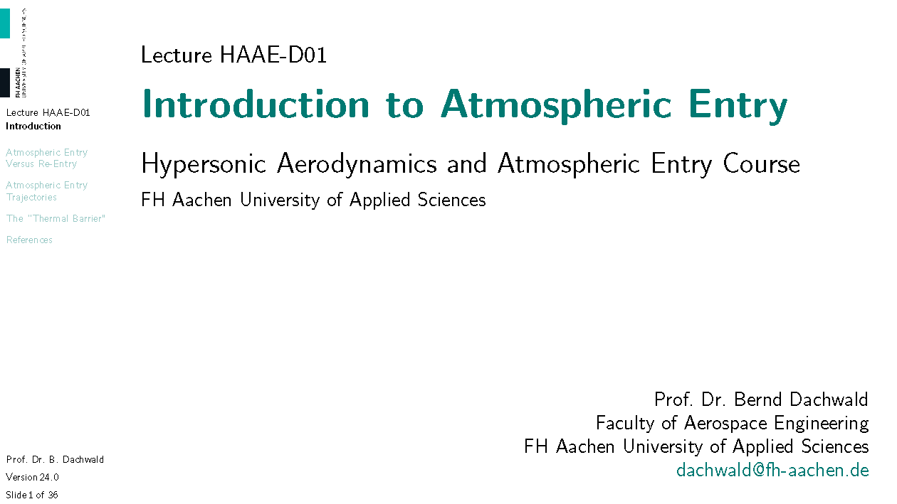

# Atmospheric Entry Versus Re-Entry

Why am I teaching you atmospheric entry dynamics? Well, in spaceflight, not all things that go up must come down. But many spacecraft do. This cartoon image shows one problem that you may encounter if you "jump over the Moon" or, more realistically, return from the Moon, like the Apollo missions, or even from Mars. You may burn up in the atmosphere. This can already happen to you if you return from the International Space Station, ISS, if you enter too steeply, as we will see later. By the way, for most satellites in a low-Earth orbit (LEO), burning up is the desired fate. It is better than staying in orbit as a piece of space debris. Therefore, atmospheric entry is a vitally important subject.

This lecture is divided into the three parts: 
- In the first part, I will give you some introductory examples and discuss why the term atmospheric entry is better than the term re-entry. 
- In the second part, we will have a look to the different types of entry trakectories (a trajectory is the path that an object follows). 
- In the third and last part, we will talk about the thermal problems that are associated with atmospheric entry.

---

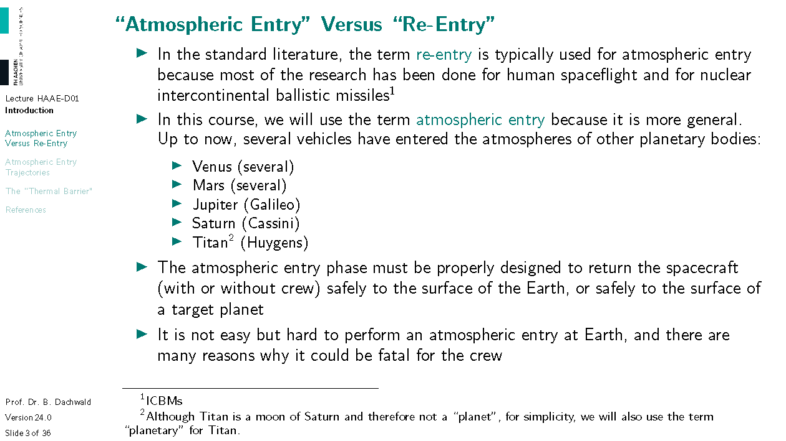

---

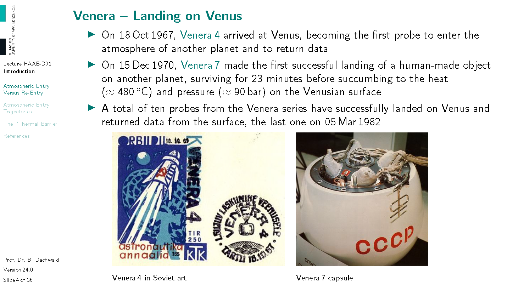

---

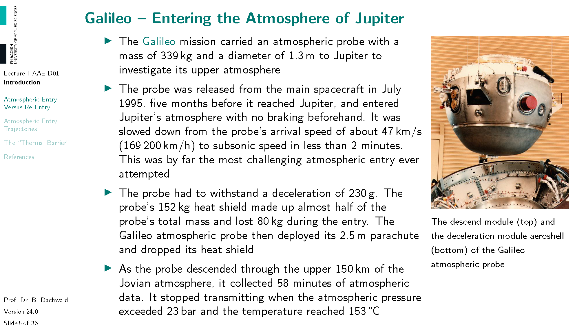

---

You can see that the atmospheric probe of the Galileo mission was built like a nut. After the heat shield was not required anymore, it opened up and released the descend module. This was further decelerated with a parachute. Also note the spin vanes, aerodynamical surfaces that were used to spin up the descend module like a spinning top, so that it has more stability during entry.

# Atmospheric Entry Trajectories

---

---

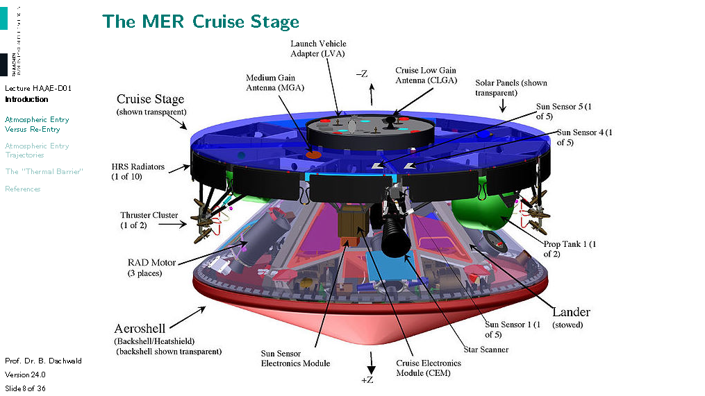

---

---

---

---

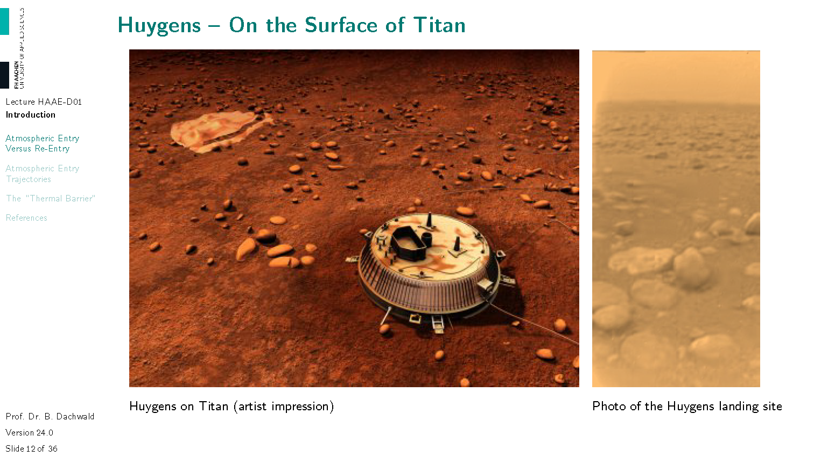

---

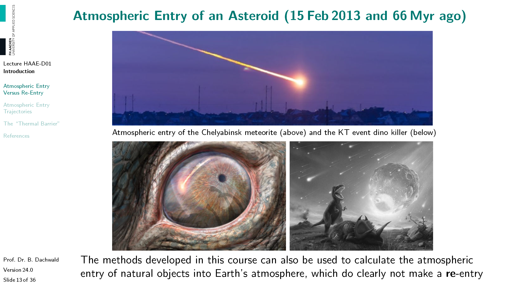

---

---

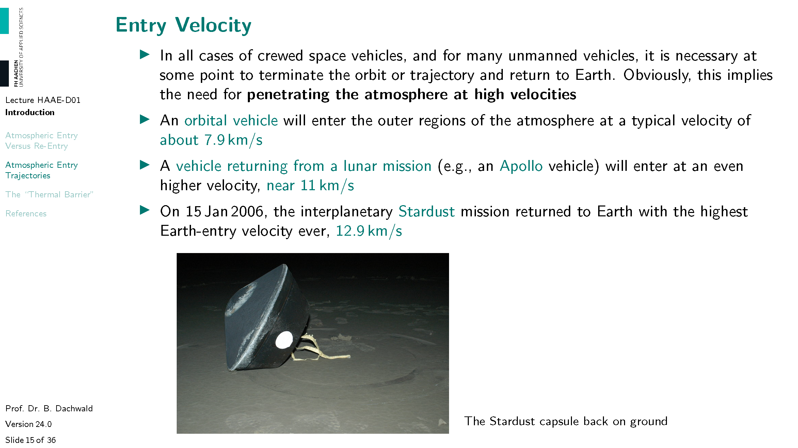

---

---

---

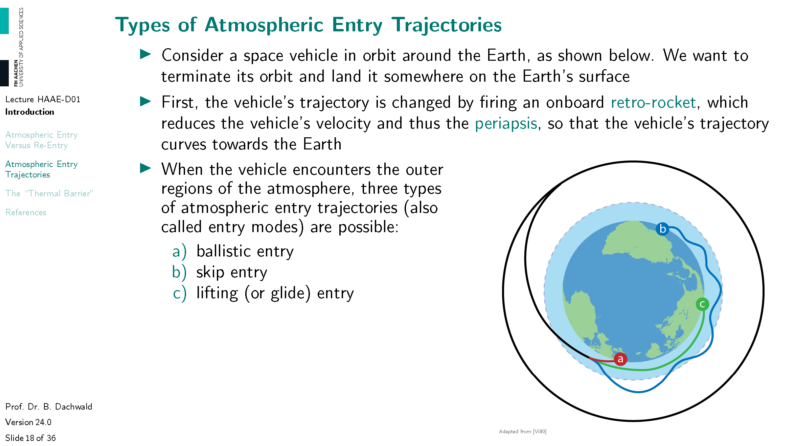

---

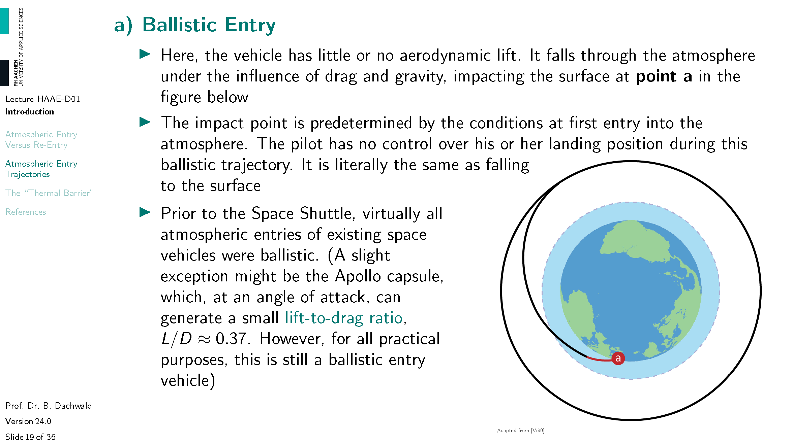

---

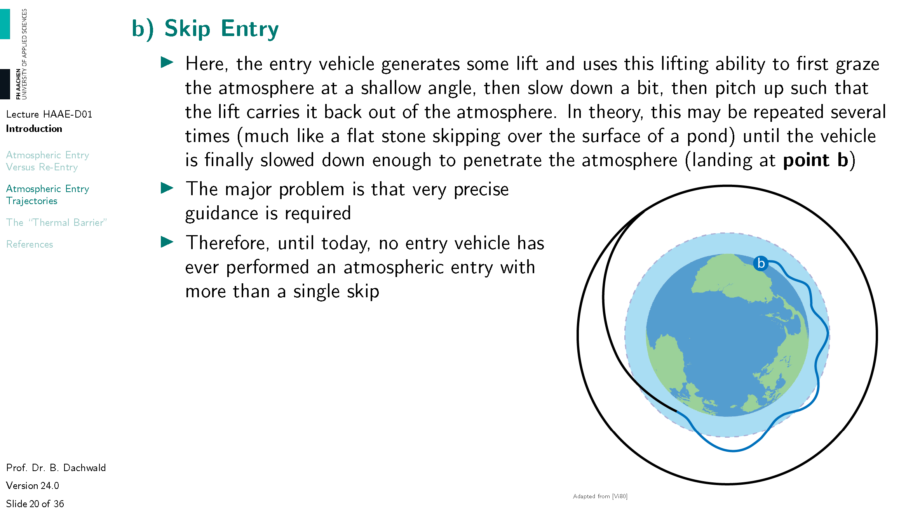

---

---

---

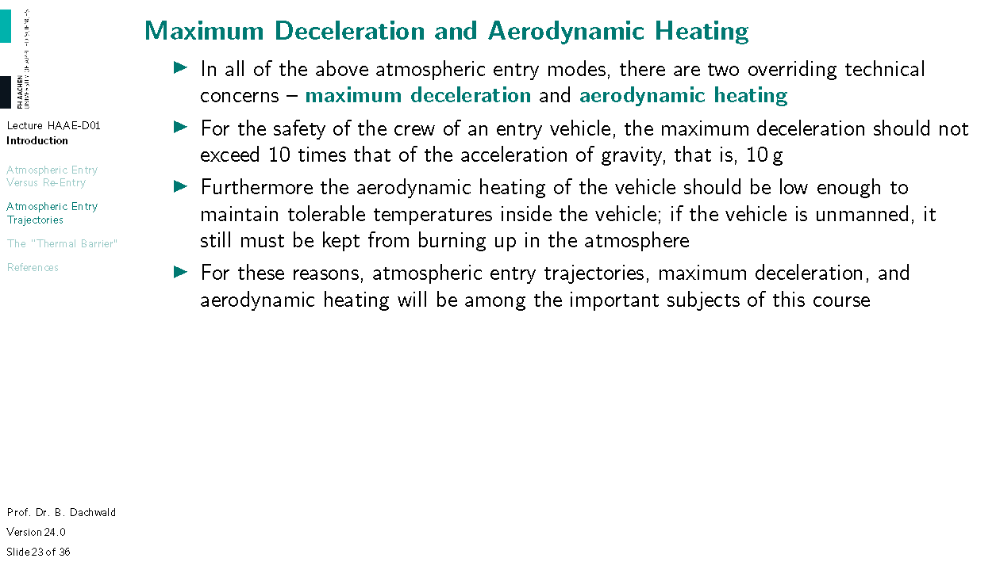

---

---

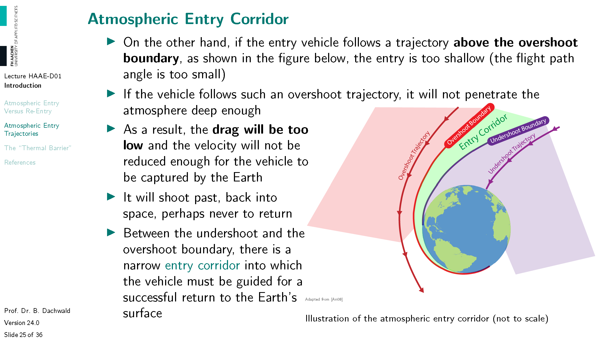

---

---

# The "Thermal Barrier"

---

---

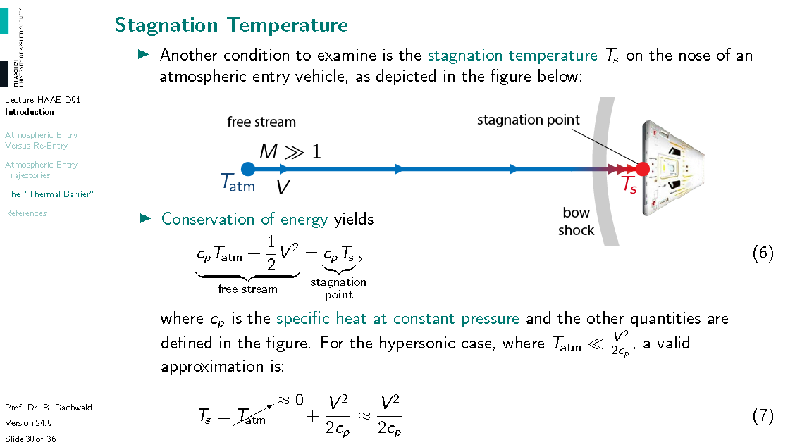

---

---

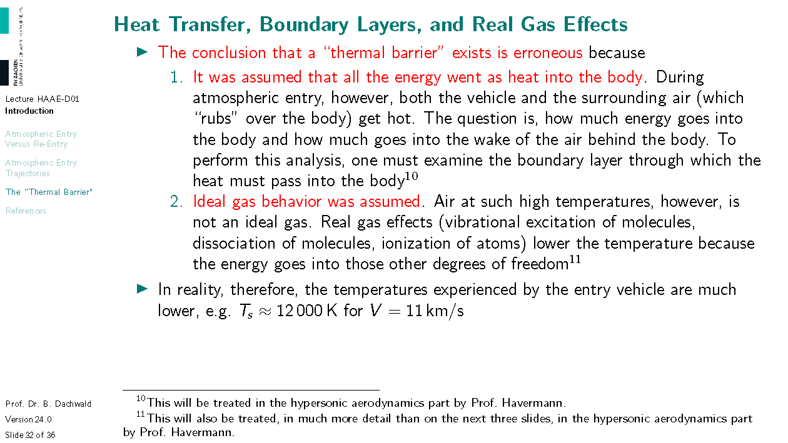

---

---

---

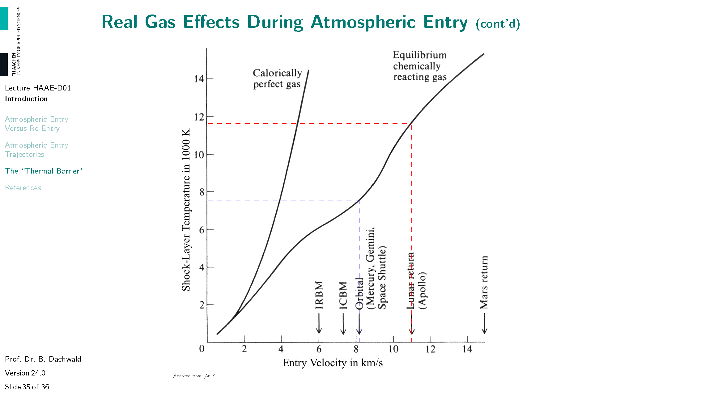

# References

You do not have to get and read the references on this slide. However, it is mandatory to cite the sources, from which you use the material (and especially images) in your own work. Therefore, I have done it. If your professional life leads you in this direction, however, you find here a collection of books you may wish to get and read.
