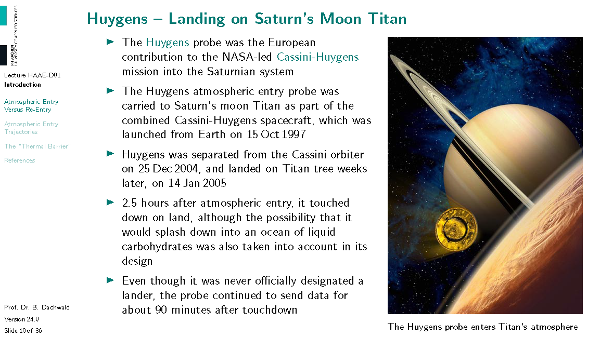
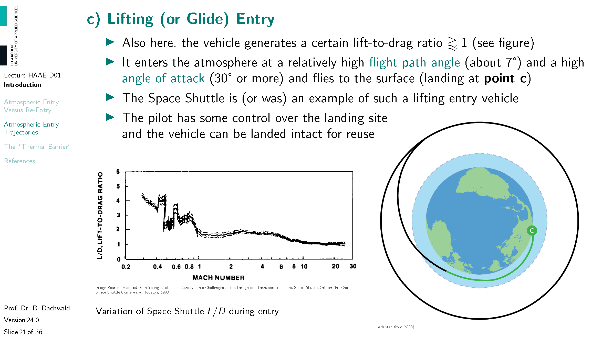
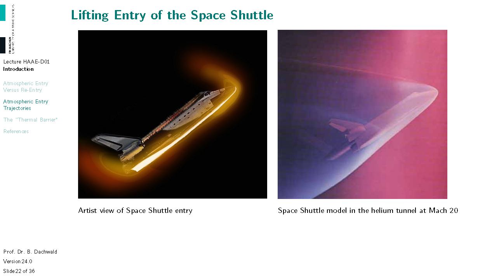
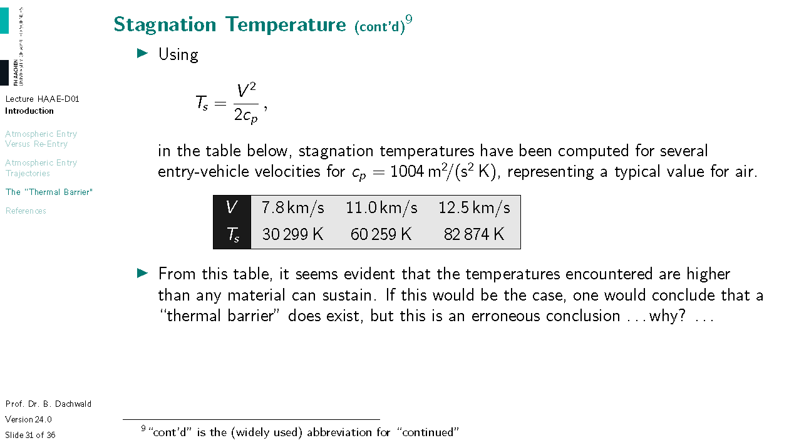

# Indroduction to Atmospheric Entry

*This handout was created exclusively for the course "Hypersonic Aerodynamics and Atmospheric Entry" at FH Aachen University of Applied Sciences by Prof. Dr. Bernd Dachwald. It contains copyright-protected material. Therefore, it may **not** be used for purposes other than educational and scientific work by students of FH Aachen University of Applied Sciences. It is not allowed to redistribute it in any form.*

# Atmospheric Entry Versus Re-Entry

Why am I teaching you atmospheric entry dynamics? Well, in spaceflight, not all things that go up must come down. But many spacecraft do. This cartoon image shows one problem that you may encounter if you "jump over the Moon" (like a children's song suggests) or, more realistically, return from the Moon, like the Apollo missions, or even from Mars. You may burn up in the atmosphere. This can already happen to you if you return from the International Space Station, ISS, if you enter too steeply, as we will see later. By the way, for most satellites in a low-Earth orbit (LEO), burning up is the desired fate. It is better than staying in orbit as a piece of space junk. Therefore, atmospheric entry is a vitally important subject.

This lecture is divided into the three parts: 
- In the first part, I will give you some introductory examples and discuss why the term atmospheric entry is better than the term re-entry
- In the second part, we will have a look to the different types of entry trakectories (a trajectory is the path that an object follows)
- In the third and last part, we will talk about the thermal problems that are associated with atmospheric entry

---

---

---

---

You can see that the atmospheric probe of the Galileo mission was built like a nut. After the heat shield was not required anymore, it opened up and released the descend module. This was further decelerated with a parachute. Also note the spin vanes, aerodynamical surfaces that were used to spin up the descend module like a spinning top, so that it has more stability during entry.

# Atmospheric Entry Trajectories

---

---

This image gives an impression of the complexity of the MER cruise stage. Look at all the different parts. What may have been the purpose of all the different parts?

---

This image gives an impression of the complexity of MER's EDL sequence. Look at all the different steps that are required for a safe landing. Landing on Mars is not easy, also because the atmosphere is variable. Many spacecraft were lost while trying to land on Mars.

---

---

During its descent, ESA's Huygens probe made many spectacular images. This panorama shows a lake with a shoreline and rivers. Before Huygens, there was much speculation about whether or not such surface features exist on Titan, but the Huygens probe made the case clear. The liquid, however, is not water but hydrocarbons. The surface of Titan is much too cold for liquid water (-179°C).

---

The left image is an artist impression of the Huygens probe after landing. You can see that it did not land in a lake (as many hoped and many feared) but on land. The right image shows a real photograph that was made by the probe after touchdown. The temperature at the landing site was -179°C and the pressure was 1.5 mbar.

---

The subject of "atmospheric entry" is not only useful for the entry of space vehicles. There are also other bodies that make an atmospheric entry, asteroids, for example. The upper image shows an asteroid just before it hit the Russian city Chelyabinsk in 2013. The lower image is an artist impression of the asteroid that, about 66 million years ago, wiped the dinosaurs off the face of this planet. The methods that we develop in this course can also be applied to calculate the atmospheric entry of asteroids.

---

---

You cannot break a space vehicle to low velocities before entering Earth's atmosphere. The orbital velocity in a low-Earth orbit (LEO) is $\gtrapprox$ 7.5 km/s. To reach this high velocity, a huge launch vehicle is needed. If you would want to brake a spacecraft to a low velocity before entering the atmosphere, you would need a rocket of about the same size, but in space!!! There is no friction in the vacuum of space! Therefore, braking requires propellant ... lots of propellant.

---

---

---

To brake, the thrust force of the retro-rocket must be against the entry body's velocity direction. This is why it is called "retro".

---

---

---

You can see that the lift-to-drag ratio, L/D, is not constant but varies along the entry trajectory. More on this in the lecture of Prof. Havermann

---

The two images just give a nice impression of the flow around a Space Shuttle at Mach 20.

---

---

So, if you are below the undershoot boundary, you will die from a too-large deceleration.

---

If you are above the overshoot boundary, the drag would be too low to slow you down enough. If you came from interplanetary space, you may fly back into interplanetary space, never to return to Earth again. Or you may get onto a highly elliptical orbit that brings you back home in a few days or weeks (so you will die because you do not have enough sandwiches on board, or, more realistically, not enough oxygen).

---

We are lucky that the Earth is not more massive. For slightly larger planets, the overshoot boundary can fall below the undershoot boundary. In this inverted "entry corridor", you die from a too large deceleration, while not being decelerated enough to not head back into space.

---

# The "Thermal Barrier"

It is typically better to use specific energies, i.e., energies per unit mass, in J/kg.

---

We will dive more into the calculation of spacecraft velocities in the second lecture.

---

The index "atm" denotes the atmospheric free-stream conditions and the index "s" denotes the conditions at the stagnation point. A free-stream volume element that impacts the entry vehicle at the stagnation point has two "forms" of energy that change along its path, thermal energy and kinetic energy (note that thermal energy is due to the random motion of particles, in all directions, while kinetic energy is due to the directed motion of particles). At the stagnation point, the velocity of the volume element becomes zero. Please verify that in eq.~(7), $T_\mathsf{atm}$ is really much smaller than $\frac{V_\infty^2}{2c_p}$ and can therefore be neglected.

---

---

---

Below an altitude of 100 km, air consists mainly of molecular nitrogen and molecular oxygen. When air (at $\approx$ 1 bar pressure) is heated to $\approx$ 2500 K, the atomic bonds between the two atoms in oxygen molecules start to break, i.e., the molecular oxygen begins to dissociate into atomic oxygen. At $\approx$ 4000 K, the oxygen is almost completely dissociated, and the molecular nitrogen begins to dissociate into atomic nitrogen. At a temperature of $\approx$ 9000 K, nitrogen is almost completely dissociated. As the temperature continues to rise, the atomic collisions become even more energetic, resulting in ionization. This process involves the removal of one or more electrons from the atoms, leading to the formation of a plasma. (Note: "no reactions" below 2500 K just means that there are no *chemical* reactions. The atomic bonds in the molecules, however, will beome vibrationally excited.)

---

When a significant amount of energy is added to air, it heats up and the atomic bond between the two atoms in a molecule becomes vibrationally excited. This vibrational energy is not available to raise the temperature. If more energy is added, as described above, the molecules dissociate and eventually become ionized. These processes consume energy and thus counteract the temperature increase. The diagram illustrates the entry trajectory of the Space Shuttle, plotting its velocity against altitude. Because of the initially high but gradually decreasing entry velocity, these real gas effects occur in reverse order. First, nitrogen is dissociated to a considerable extent, while oxygen is dissociated completely. Later, the lower energy input is sufficient only for oxygen dissociation, and still later, only for vibrational excitation.

---

The diagram above depicts the shock-layer temperature over the entry velocity. It also compares a perfect gas to a real gas. The entry velocities of several space missions are indicated on the horizontal axis. As you can see, the perfect-gas assumption yields much higher temperatures than are obtained in reality. Nevertheless, the temperatures are still very high, almost 8000 K for an entry from LEO and almost 12000 K for a lunar return. Note that for such high temperatures, it does not really make a difference whether the temperatures are given in K or in °C.

# References

You do not have to get and read the references on this slide. However, it is mandatory to cite the sources, from which you use the material (and especially images) in your own work. Therefore, I have done it. If your professional life leads you in this direction, however, you find here a collection of books you may wish to get and read.
