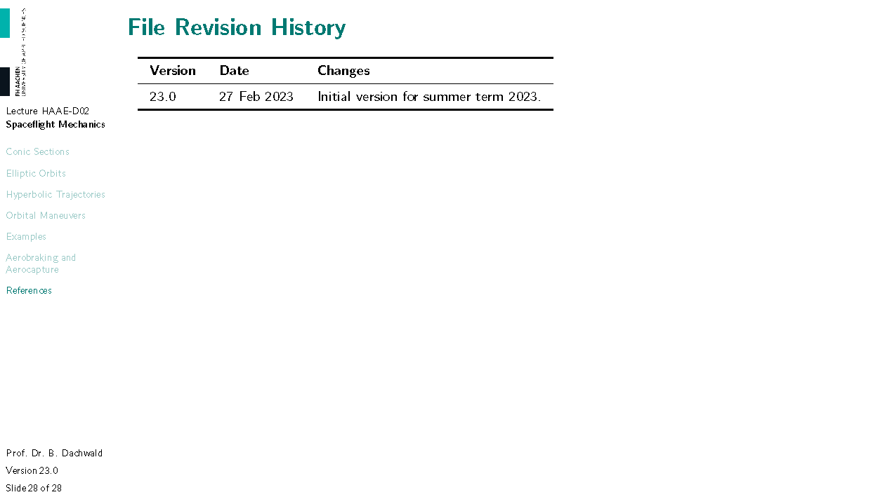

# Fundamentals of Spaceflight Mechanics for Atmospheric Entry

*This handout was created exclusively for the course "Hypersonic Aerodynamics and Atmospheric Entry" at FH Aachen University of Applied Sciences by Prof. Dr. Bernd Dachwald. It contains copyright-protected material. Therefore, it may **not** be used for purposes other than educational and scientific work by students of FH Aachen University of Applied Sciences. It is not allowed to redistribute it in any form.*

---

# Conic Sections

---

---

---

# Elliptic Orbits

---

# Hyperbolic Trajectories

---

# Orbital Maneuvers

---

---

---

# Examples

---

---

---

---

---

---

---

---

# Aerobraking and Aerocapture

---

---

---

# References

---

