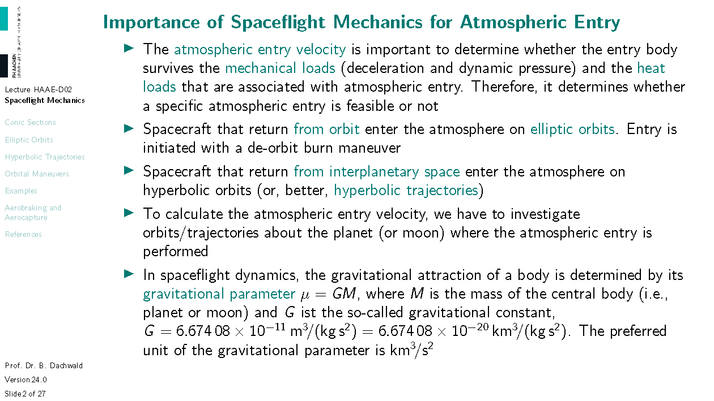
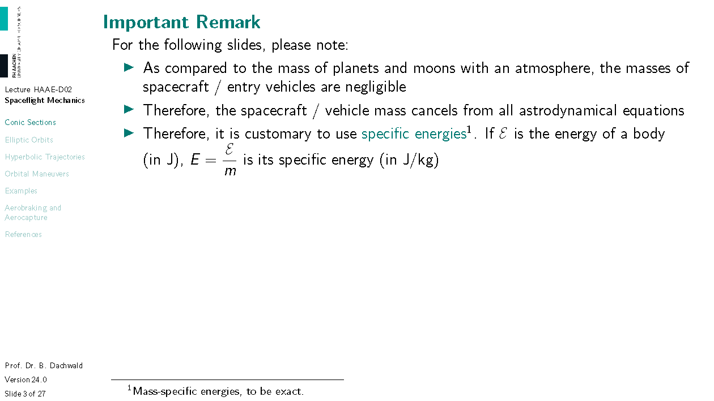
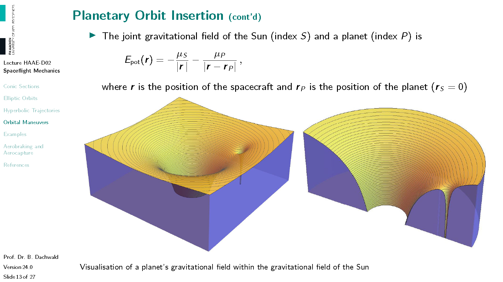
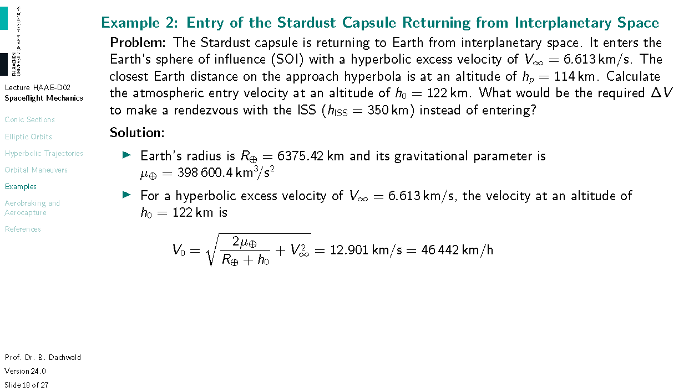
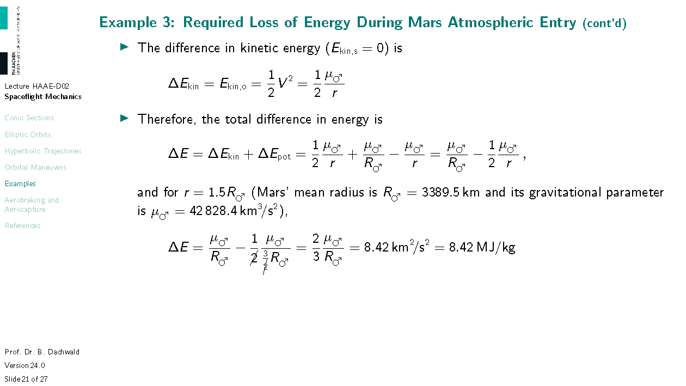

# Fundamentals of Spaceflight Mechanics for Atmospheric Entry
**Version 23.1, Last Update: 18 Mar 2024**

*This handout was created exclusively for the course "Hypersonic Aerodynamics and Atmospheric Entry" at FH Aachen University of Applied Sciences by Prof. Dr. Bernd Dachwald. It contains copyright-protected material. Therefore, it may **not** be used for purposes other than educational and scientific work by students of FH Aachen University of Applied Sciences. It is not allowed to redistribute it in any form.*

---

For atmospheric entry calculations, the entry velocity $V_0$ of an entry vehicle is the most important parameter (together with the entry angle $\gamma_0$). In this sense, this week's lecture is not intended as a crash course (forgive me the word) into spaceflight mechanics. We will only cover the subjects that are necessary to calculate $V_0$. I'm sure you already know that the atmosphere does not have a fixed interface to the vacuum of space (although the legal definition for "space" is the altitude of 100 km, but here we don't care about legal stuff, just about physics). In the most simple model, starting with a ground density of $\rho_0$ at the surface, the atmosphere gets exponentially thinner with altitude $h$, i.e., in mathematical writing: $\rho \propto e^{-h}$, where $\propto$ reads "proportional to". Nevertheless, in practice, we get the best analytical results, if we assume that there is no atmosphere for $h >$ 122 km (note: not 100 km!) and then the exponential atmosphere for $h \le$ 122 km. So we "only" have to calculate the entry vehicle velocity $V_0$ at this altitude of $h_0 =$ 122 km. Unfortunately (or fortunately?), this requires some basic knowledge on spaceflight dynamics, especially elliptic orbits and hyperbolic trajectories (since those are the conic sections / entry trajectories that entry vehicles must use), spheres of influences, and orbital maneuvers (to change the vehicle's trajectory). At the end, we will look at three examples that hopefully bring life to the theory that some of you may consider boring.

Note for bullet point 3: In the so-called two-body problem (e.g. Earth and spacecraft), an ellipse is a closed, repeating path. A hyperbola is an open path that - mathematically - comes from infinity and goes back to infinity. (Of course, infinity does not exist in reality, but the difference between very veery veeery far away and infinitely far away is practically negligible.) It is better to call open paths trajectories, since the word *orbit* (and *orbiting* and *orbiter*) sounds "repeating".

Note for bullet point 4: We use the gravitational parameter $\mu$ of a planet because the masses $M$ of the Earth and the planets are not well known. Compared to other constants like the speed of light, the gravitational constant $G$ is also not very well known, with only 6 significant digits. This is not precise enough for spaceflight. However, their product $\mu = GM$ is known to a very high precision. Why is that? Because this is the *only* parameter that "acts" on spacecraft, and so it can be measured very precisely. If we know $\mu$, we do not have to care if $G$ is a bit smaller and $M$ is a bit larger or vice versa, only their product, $\mu$, is important.

# Conic Sections

Note: "Spacecraft" is a strange word (like "aircraft"). Its plural form is the same. One spacecraft, two spacecraft, and so on. If you don't believe: google!

---

A spacecraft (flying in space, of course) has only two forms of mechanical energy: kinetic energy (you know this formula) and potential energy. For the potential energy, we use a different definition than in high school physics. From your physics classes, you probably remember $E_\mathsf{pot} = gh$ (not $mgh$ since we are dealing with specific energies!). But in space, this is not useful: $g$ changes and where is $h=0$? To relate the potential energy of an interplanetary spacecraft to the surface of the Sun would be quite absurd. We need a more suitable definition (and this is not even more complex): $E_\mathsf{pot} = -\mu/r$. Why the minus sign? Well, if you fall towards Earth ($r$ gets smaller), your kinetic energy (velocity) increases. Therefore, your potential energy must decrease. Without the minus sign, it would increase. Where is $E_\mathsf{pot} =$ 0? Only at infinity. So it is always negative. And another typical question: can $E_\mathsf{pot}$ become $-\infty$? Answer: only for point masses. In reality, $r>R$, where $R$ is the radius of the central body. "Central body"? The central body is the body in which gravitational field you are flying (we will come back later to this concept when we discuss a body's sphere of influence). Note: on the surface of the central body, your potential is now **not** $E_\mathsf{pot}=0$ **but** $E_\mathsf{pot}=-\mu/R$.

---

On a closed orbit, the orbital energy (sum of kinetic and potential energy) must be negative. Why? The maximum value for the potential energy is $0$ at $\infty$. Consequently, for $E>0$, even at $\infty$, the spacecraft would still have some remaining velocity. Now, this is not what we call a *closed* orbit. For the theoretical borderline case of a parabolic orbit, $E=0$. Well, this is "theoretical" because, in reality, the orbital energy is never *exactly* zero.

---

Note that the vis-viva equation is the most important equation in spaceflight dynamics. Why? Because it relates distance from the central body, $r$, with velocity $V$. Note that the parameter $a$ is a constant for an orbit that does not change (unless we make a thrust maneuver).

# Elliptic Orbits

According to Kepler's first law, all (closed) orbits are ellipses with the central body at one of the two foci (plural of "focus") of the ellipse. The orbit's closest point to the central body is called periapsis (or pericenter), the farthest point is called apoapsis (or apocenter). The distance between periapsis and apoapsis is the so-called major axis. However, as we are typically using the radius instead of the diameter for circles, we are here also using half of the major axis for our calculations, the so-called **semi-major axis** $a$. So $a$ defines the *size* of the ellipse. Another important parameter for an ellipse is the so-called **eccentricity**. It defines how "squashed" an ellipse is (the distance between a focus and the center point of the ellipse is $c = e \cdot a$). So it defines the *shape* of an ellipse. The periapsis radius is $r_p=a(1-e)$ and the apoapsis radius is $r_a=a(1+e)$. The last *important* parameter is the so-called **true anomaly** $f$, the angle which defines the *location* of a spacecraft on the ellipse. The true anomaly is the angle between the line from the central body to the periapsis and the line from the central body to the spacecraft. Note that some authors use $\theta$ for the true anomaly, while others use $\varphi$ or $\nu$.

If you want to know more on elliptic orbits, please refer to https://en.wikipedia.org/wiki/Elliptic_orbit, or, if you are crazy enough to be even more interested in ellipses, please consult https://en.wikipedia.org/wiki/Ellipse.

---

Note that the equation for the circular orbit is the one that we have used in the first lecture to calculate the orbital velocity. Also note that it is sufficient to change the velocity of a spacecraft by $$\Delta V=V_\mathsf{para}-V_\mathsf{circ} = (\sqrt{2}-1) V_\mathsf{circ} = 0.4142\cdot V_\mathsf{circ}$$ to leave the central body towards infinity and never come back.

# Hyperbolic Trajectories

---

# Orbital Maneuvers

---

The SOI-concept is used to transfer the analytically unsolvable three-body problem (Sun, Earth, spacecraft) or even four-body problem (including also the Moon) into a two-body problem, considering that typically only the gravitation of one body is dominant. Therefore, only one body is the central body and all the other ones are so-called disturbing bodies, which "disturb" the spacecraft's motion. But when we are somewhere between the Earth and Sun, which body should we use as "the central body" and which one as the disturbing body? Or: when do we fly around the Earth and when do fly around the Sun? The SOI-concept is a practical (and still accurate) solution for this problem. The Earth has a SOI with a radius determined by eq. (12). Inside the SOI, we fly around the Earth, outside, around the Sun. Note that this definition is quite arbitrary, but that should not bother us here in this course (but in the course Computational Spaceflight Dynamics). If you want to know more about the SOI-concept, please have a look at https://en.wikipedia.org/wiki/Sphere_of_influence_(astrodynamics).

---

I have calculated this image with the scientific software Mathematica to visualize the SOI-concept better. It shows the combined gravitational 2D-field of the Sun and an hypothetical very massive planet (with a mass of 0.001 solar masses, otherwise you would not see its tiny SOI). Look how simple the equation is that generates this image. Inside the small "funnel" you are in the SOI of the planet, outside, you fly around the Sun.

---

Eq. (14) gives simply the difference between the desired velocity on the circular orbit and the actual velocity on the hyperbolic trajectory - at the same point! The latter is higher, therefore we have to break. But the $\Delta V$ is always counted positive, therefore we use always the absolute value.

# Examples

This table gives the gravitational parameter $\mu$ and the radius $R$ for all planets, the Sun, and Titan. Note that the radius occurs in all spaceflight equations. If you have the altitude $h$, you have to calculate the radius as $r=R+h$. Also note that in spaceflight, we use the kilometer as the unit of length, not the meter, because we do not want to calculate with huge numbers. 

---

---

---

---

---

---

---

---

As you can see, in contrast to Earth, entering the atmospheres of Mars and Titan requires less energy to be dissipated. But for the giant planets, the energy dissipation would be extremely large.

# Aerobraking and Aerocapture

---

---

---

# References

