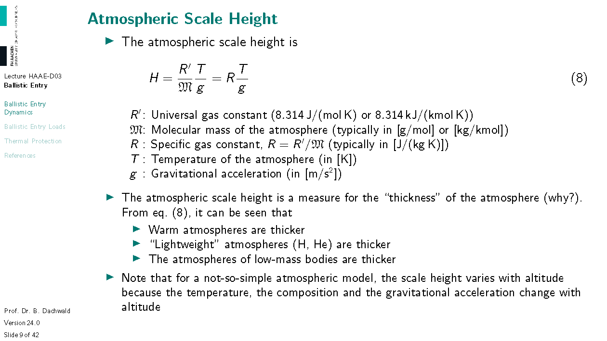
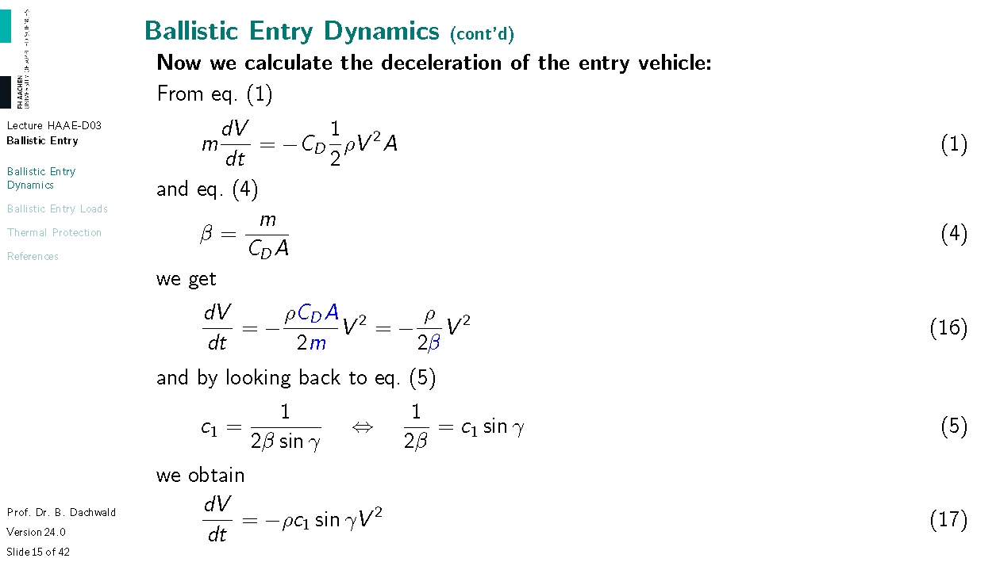
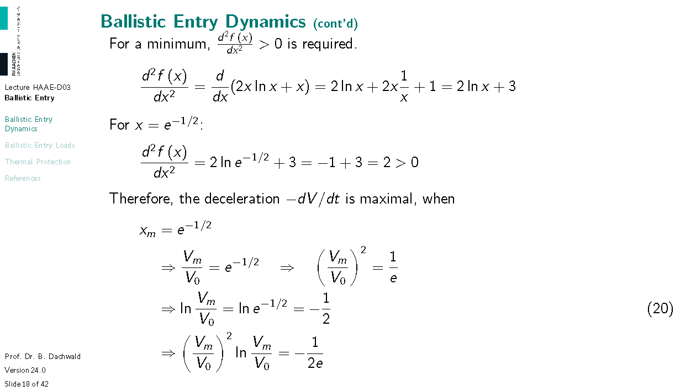
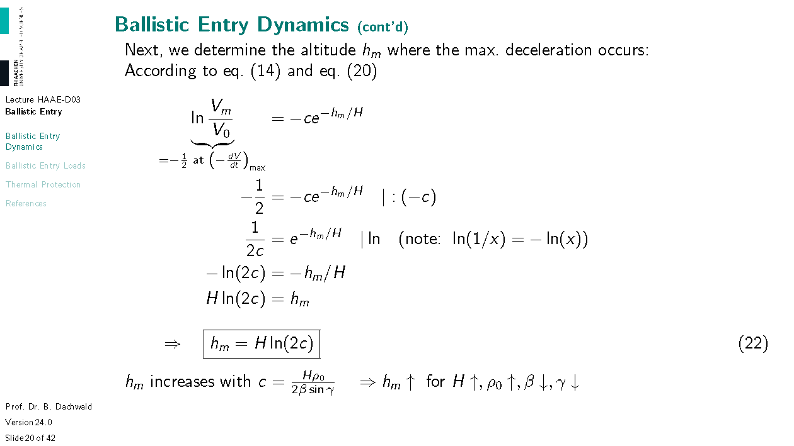
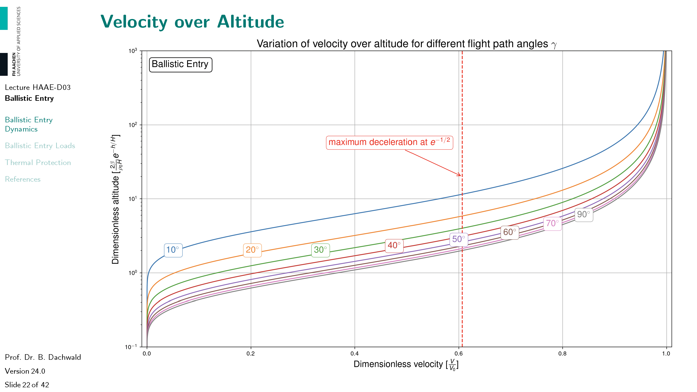
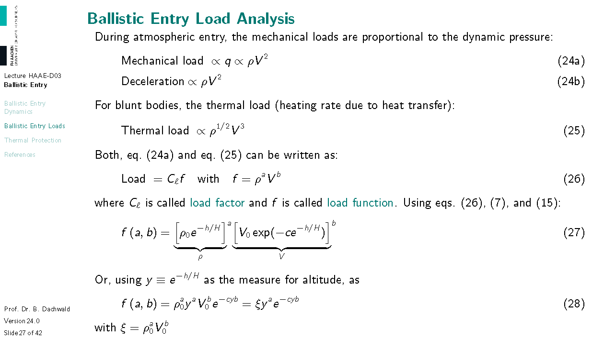
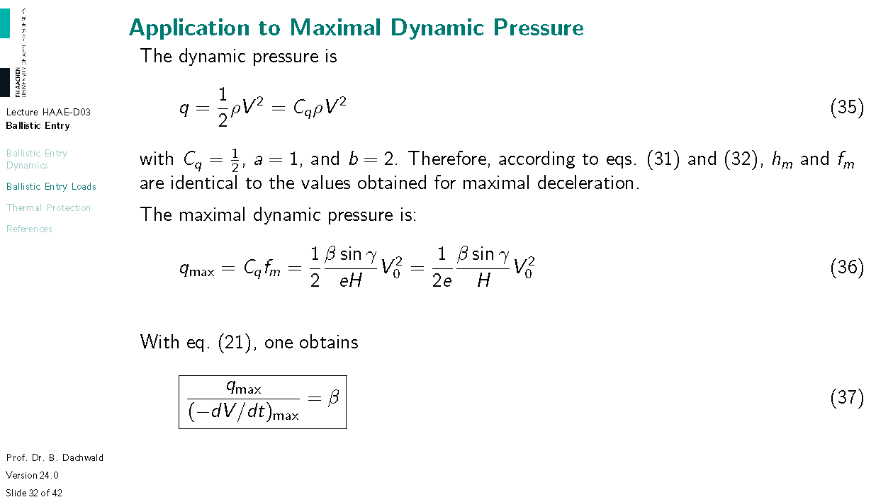
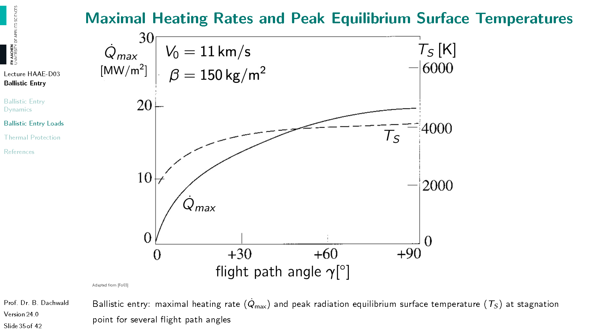
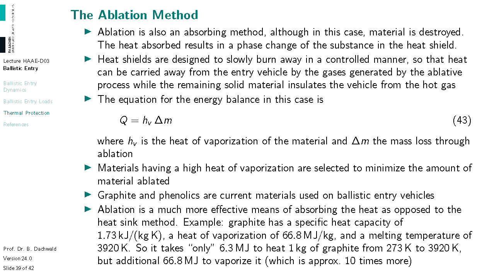

# Ballistic Atmospheric Entry
**Version 24.0, Last Update: 21 Apr 2024**

*This handout was created exclusively for the course "Hypersonic Aerodynamics and Atmospheric Entry" at FH Aachen University of Applied Sciences by Prof. Dr. Bernd Dachwald. It contains copyright-protected material. Therefore, it may **not** be used for purposes other than educational and scientific work by students of FH Aachen University of Applied Sciences. It is not allowed to redistribute it in any form.*

In this lecture we will have a look at ballistic atmospheric entries. One has to be a bit careful with what "ballistic entry" means. Sometimes it means that all forces except drag are neglected. More precisely, this is a "ballistic calculation". Sometimes it means that the vehicle doesn't produce lift (but gravity still acts onto the vehicle). More precisely, this is a "ballistic vehicle". Typically, like in this lecture, one assumes both, doing ballistic calculations for ballistic vehicles. In the next lecture, we will then calculate the "real entry" (with gravity) of a ballistic vehicle and compare it with our results from this lecture.

# Ballistic Entry Dynamics

Actually, the third assumption follows from the second one. If there is no force that is acting perpendicular to the velocity, the direction of the velocity cannot change (only the magnitude) and therefore the flight path angle must remain constant.

---

Note that eq. (1) results from the simple application of Newton's second law to the given situation depicted on the last slide. Since everything happens in velocity direction, we do not have to deal with a vector differential equation but only with a simple scalar differential equation. The description of most mechanical problems starts with such an **equation of motion**. Unfortunately, for many (or even most) real-world problems, nature is not nice to us. The equations do not tell us how the velocity $V$ is at time $t$, it only tells us how $V$ changes, i.e., $dV/dt$. We have to find $V(t)$ by integration, which is often so difficult that it cannot be done analytically. Given our simplifications, it is possible. But even for this much simplified problem – as you will see – an analytical calculation gets relatively complex.

It is very useful to merge all entry-body-related parameters into one single parameter, because then, the whole entry depends on just this single parameter. All vehicles with the same $\beta$ will have the same variation of velocity $V$ over altitude $h$. 
The close relative of the ballistic parameter, by the way, is also used in health, sports, and medicine, and is called body mass index or BMI. Your BMI is your weight (or, more accurately, mass) divided by the square of your body height. So you can visualize the ballistic parameter as the BMI of an entry vehicle.

---

Always try to find meaning in equations. Most physical equations are not just for calculating something (this is primitive) and actually you can't currently calculate anything with eq. (3), but it has **physical meaning**: for a higher density $\rho$, your variation of velocity with altitude, $dV/dh$, will be higher and the dependence is linear; also for a higher velocity, $V$, it will be higher and the dependence is linear; for a higher ballistic coefficient $\beta$, in contrast, your variation of velocity with altitude will be lower and the dependence is inversely linear; and so on. What does a high $\beta$ mean? Hm, what would be a memorable example? A cannonball! And an example for a low $\beta$? An air balloon! OK, then eq. (3) – without any calculation – says that, due to drag, an air balloon will experience a higher deceleration than a cannonball. (I use here the term deceleration, but note that it is actually not the "typical" deceleration, which would be variation of velocity with *time*, $dV/dt$, but $dV/dh$.) Also, always ask yourself: "Does this make sense?". Well, here, yes, does it? If it does not, you may have either an error in your calculation or in your understanding.

For a given entry problem, both $\beta$ and $\gamma$ do not change. Therefore, we can save work by defining the new constant $c_1$. We use the name $c_1$ to save the name $c$ for a later use.

You can see already on the right side of eq. (6) that we will integrate by the method of "separation of variables". Everything associated with $V$ goes to the left side, everything associated with $h$ goes to the right side. Everything else typically also goes to the right side.

---

Why do we use a standard atmophere and not the real one? Well, if you do not use a standard atmosphere but the "real" one (here and right now), calculations are not comparable. Therefore, a standard atmosphere is used for analyzing flight problems and comparing results. The real atmosphere is only used later for "real" calculations. For our analysis, it is sufficient to use the most simple atmospheric model.

---

---

It is a good exercise to derive eq. (7) by yourself. A good aerospace engineer should be able to do this calculation in a pub, in the middle of the night, after having consumed too much beer, on the back of an envelope. There are two parameters in this equation, the ground density $\rho_0=\rho(h=0)$ and the atmospheric scale height $H$, which is an assembly of other constants (see slide 9). Note that the given values for $\rho_0$ and $H$ are not the real values on ground but values that give the best overall fit for $0\,\mathrm{km} \le h\le 122\,\mathrm{km}$. 

The plot shows density over altitude, but good engineers plot exponential functions not like this. Nobody can read the values in the range $40\,\mathrm{km}\le h\le 122\,\mathrm{km}$.  

---

Good engineers plot such a function as a logarithmic plot (or as a double-logarithmic plot). Here you can read all values easily. Please remember this also for your master thesis. I see too many plots where the originator seem to think "Well, I have plotted this data. Job done. Can other people read it? Well, not my problem, I don't care.". But a professional reader like your future boss will care and throw the bad plot right into your face. 

---

---

What is the "real" meaning of $H$? First we note that the argument of an exponential function must be unitless, a pure number. Then we insert $h=H$ into the equation. The result is $\rho(h=H)=\frac{\rho_0}{e}$, where $e = 2.71828$ is the Euler number. So $H$ is the altitude at which the density has decreased to $1/e$ times the value on the ground. 

---

---

In the following calculations, try to check every step and ask yourself "Why are we doing this step?" If you can't answer this question right now, don't worry. Just follow all steps until slide 21. Then go back and answer this "Why are we doing this step?" question.

---

---

So we have finally found the variation of the velocity with altitude. It's more than exponentially decreasing. An exponential function with another exponential function in the exponent. Wow!

---

---

In eq. (19), we have used a simple trick: $V^2=V_0^2\frac{V^2}{V_0^2}$, because $\left(\frac{V}{V_0}\right)^2\ln\frac{V}{V_0}$ is a much nicer expression than $V^2\ln\frac{V}{V_0}$. Why? You will see.

---

Now you should see. It is easier to find the minimum of the expression $x^2\ln x$ than of an expression $x^2\ln\frac{x}{c}$. Also, we can be sure that $0\le x \le 1$. The notation $a \equiv b$ means that both sides, $a$ and $b$, are equivalent by definition.

---

---

Now, we have finally found the maximal deceleration. It depends only on the scale height $H$, the entry velocity $V_0$ and the flight path angle $\gamma$. Strangely, it does not depend on the ballistic coefficient $\beta$. So how can we reduce the maximal deceleration? We have no influence on $H$. $V_0$ is given by spaceflight mechanics (lecture 2). We could reduce $V_0$ by a thrust maneuver, at least in principle, but this would cost a huge amount of propellant. Therefore, we have only a single parameter under our control that allows us to influence the maximal deceleration, the flight path angle $\gamma$ (... and this is determined in a not-so-straightforward way by the periapsis).

---

---

---

While the equations on the last slides are useful to calculate desired values, diagrams are better to visualize equations. Diagrams make equations "speak". This diagram shows velocity of altitude for different flight path angles. Normally, you would get a different diagram for every different setting of the parameters $\rho_0,H,V_0,\beta$. Not here, because the altitude and the velocity have been made dimensionless. So, $0 \le \frac{V}{V_0} \le 1$ is a "new" dimensionless measure for the velocity and $\frac{2\beta}{\rho_0H}e^{h/H}$ is a "new" dimensionless measure for the altitude. As you can see in the diagram, the larger the flightpath angle, the deeper is the penetration of the vehicle into the atmosphere until it is slowed down.

---

This diagram shows (again dimensionless!) deceleration over altitude for different flight path angles. As you can see, the larger the flight path angle, the higher the deceleration at every altitude. The dashed line connects the points of maximal deceleration. You can see: the larger the flight path angle, the deeper in the atmosphere is the maximal deceleration.

---

This diagram shows the influence of the flight path angle onto the maximal deceleration for two different velocities. Note that both curves are proportional to $\sin(\gamma)$ (they are *not* proportional to $\gamma$!). In this diagram, I have colored the decelerations: green stands for survivable, yellow for hardly survivable, and red for not survivable. As you can see, for a ballistic entry, the flight path angle must be quite small; otherwise the crew will die. (For aerospace engineers, it is very easy to kill astronauts. There are thousands of different ways to do that. Please do not become one of those "hazardous engineers" who do things they don't understand.)

---

This is just a magnification of the diagram on the last slide, so that you better see the range $0^\circ \le\gamma\le 10^\circ$. Note that these are not two straight lines, they still have the shape of a sine curve, although this is hardly visible (because for $\gamma\le 10^\circ$, the difference between $\gamma$ (in radians) and $\sin(\gamma)$ is less than $0.51\%$).

---

As you can see from the table, Titan and Mars allow even large flight path angles for entry. For Earth, $\gamma = 2.5^\circ$ is already critical for a human mission. So, $\gamma = 2.5^\circ$ is already close to the undershoot boundary or even below (for astronauts that have spent months in weightlessness). For small flight path angles, entries at the giant planets are *not much* worse than at Earth, except for Jupiter, where even for $\gamma = 2.5^\circ$, $100\,\mathrm{g}$ are reached.

# Ballistic Entry Loads

Now, that we have calculated the maximal deceleration via the hard physical way, we will now use a more general but also more abstract approach to calculate the maximal deceleration. The advantage of this more general "load analysis" is that we can also use it to calculate the thermal load, i.e., heating rate (and to check our previous calculation for the maximal deceleration for correctness). When the lives of people depend on the correctness of your calculations, it is always better to have two independent approaches that give the same results.

Again, in the following calculations, try to check every step and ask yourself "Why are we doing this step?" If you can't answer this question right now, don't worry. Just follow all steps until slide 34. Then go back and answer this "Why are we doing this step?" question.

Remember that the symbol $\propto$ means "proportional to". In the following calculations, you will see the power of mathematics. We do not need actual numbers, it is already sufficient for every load to know what it is proportional to.

$C_\ell$ is called "load factor". Note that $y$ is by definition just a "new" measure for altitude. We introduce the abbreviations $y$ and $\xi$ to make the following calculations, which are a bit awkward, a bit less awkward. 

---

Of course the derivation of the load $f$ with respect to our new altitude $y$ must be zero for a maximum. The altitude where $y$ is maximal is termed $y_m$. So the index "$m$" means "where the load is maximal".

---

Now we know the maximal load function, $f_m = \left(\frac{\rho_0 a}{b c e}\right)^a V_0^b$, the altitude where the maximal load occurs, $h_m = H \ln\left(\frac{b c}{a}\right)$, and the velocity at which the maximal load occurs, $V_m = V_0 e^{-a/b}$. Note that those formulas hold for every load: dynamic pressure $q$, deceleration $-dV/dt$, and thermal load $\dot Q$. 

---

So let us apply our new mathematical "tool" first for the maximal deceleration.

---

As you can see, we get exactly the same results with this very different approach. Therefore, we have now confidence that load analysis is correct and we can apply it now to dynamic pressure and heating rate.

---

It is interesting to see that the equation for the maximal dynamic pressure is very similar to the equation for the maximal deceleration. Simply $q_{\max} = \beta \cdot (-dV/dt)_{\max}$. It was already astonishing that the maximal deceleration does not depend on the ballistic coefficient $\beta$. But the maximal dynamic pressure does! So the maximal dynamic pressure (and thus dynamic and structural load) is larger for a cannonball-like entry vehicle than for a balloon-like entry vehicle (and actually a balloon-like vehicle with a low $\beta$ may survive an atmospheric entry, if the material is strong enough). 

---

You can see that the maximal heat flux happens before the maximal dynamic pressure and thus structural load. This physical fact killed the seven astronauts of the Space Shuttle Columbia on 01 Feb 2003. During the launch, a piece of foam insulation broke off from the Space Shuttle external tank and struck the left wing of the orbiter. When Columbia re-entered the atmosphere, the damage allowed hot atmospheric gases to penetrate the wing and to heat up the its internal structure. The later structural load maximum then caused the wing to break apart. If the maximal structural load would have acted onto the still cold wing structure, the Shuttle may have survived entry and so the crew. But, unfortunately, $e^{-1/6} > e^{-1/2}$.

---

As you can see, for heating, a high entry velocity $V_0$ is much more a problem than a large flight path angle $\gamma$.

---

This diagram gives you an impression of typical maximal heating rates and maximal radiation equilibrium surface temperatures at the stagnation point. For the latter, it is assumed that all the incoming heat is radiated away, thus according to Planck's law: $\dot Q_{\max} = \varepsilon \sigma (T_S)_{\max}^4$, where $\varepsilon$ is the emissivity and $\sigma$ is the Stefan-Boltzmann-constant (more on slide 40).

---

The heating rate strongly depends on the entry type. Vehicles that are entering very quickly (with a large $\gamma$) like a ballistic missile, have very high peak heating rates for a short time. For a gliding entry, however, where $\gamma$ is small, heating rates are lower but act for a longer time. "Btu" stands for "British thermal unit". It is defined as the amount of heat required to raise the temperature of one pound of water by one degree Fahrenheit. And, well, the abbreviation for the second in the international SI system is simply "$\mathrm{s}$" and not "$\mathrm{sec.}$" or "$\mathrm{sec}$".

# Thermal Protection

To prevent the entry vehicle from burning up in the atmosphere, thermal protection systems (TPS) must be used. The optimal choice for a TPS depends on many factors. Especially important are the maximal heating rate / heat flux, $\dot Q$, and the total heat load, $Q$. as you can see on slide 41. But first, let's have a closer look at three different TPS methods, the heat sink method, the ablation method, and the radiation cooling method.

---

---

---

---

Radiation cooling, as it was done by the Space Shuttle, is the easiest (although not cheapest) TPS method. No material is consumed by the heat so that the TPS can be re-used. But the maximum heat flux is limited. For the Space Shuttle, this was challenging but still possible, but for the Mercury capsules, radiation cooling would not have been sufficient. They have used an ablation heat shield. Why is the limiting curve for ablation cooling decreasing for increasing durations? Because for ablation cooling, heat shield material is consumed. And the higher the heat flux, the quicker it is consumed. It has a maximum capacity. The same is true for heat sinks.

# References

